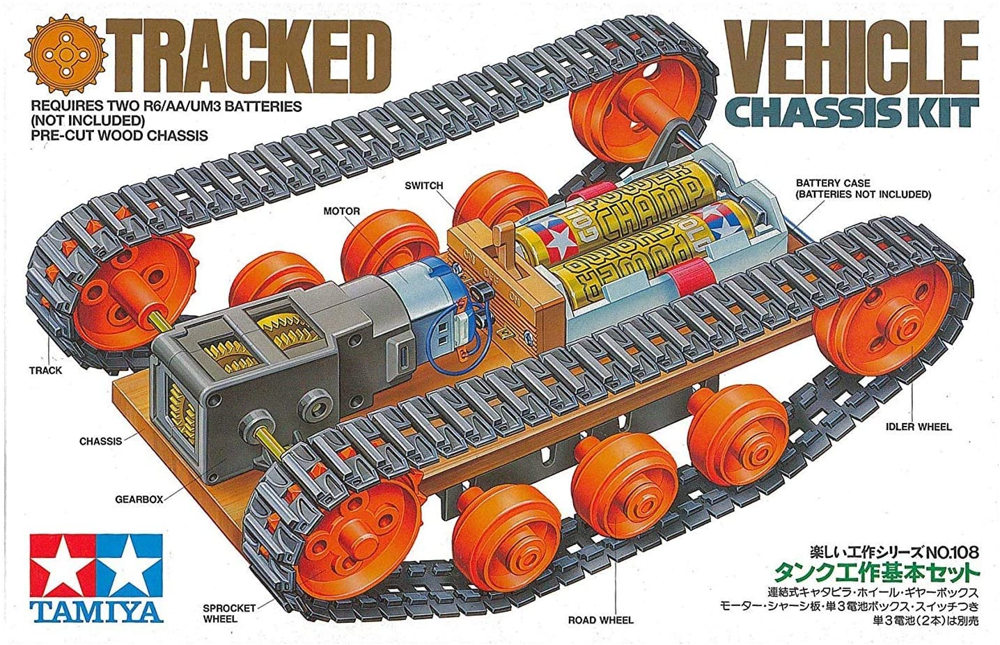
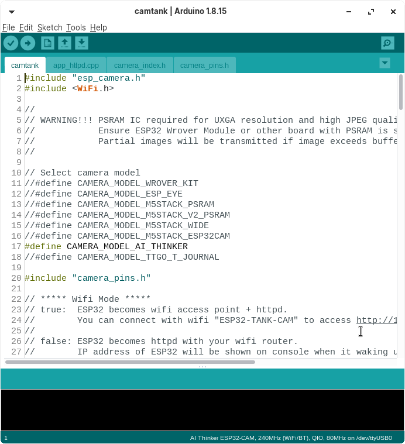

# Cam Tank
Cam tank はWifi接続でPCから操作可能なCameraストリーミング付き戦車です。

  
  

# 実装

## 準備
以下のようなものを用意してください。

* ESP32-CAM
* タミヤの戦車キット（２モーターに置き換えます）
* モータードライバ（２モーター用） 
* バッテリ x 2 （ESP32用とモーター用で２つ用意が必要です）
* サーボ x 2 （任意。推奨しません。ESP32のカメラと干渉することを確認しています。)
* カメラマウント　(任意。推奨しません。)

ESP32

タミヤのタンクキット

ドュアルモーター

モータードライバ

カメラマウント 

## ESP32 セットアップ
### プログラムのインストール
1. GITからソースコードをダウンロードします。   
以下のコードでCloneできます。 
`git clone https://github.com/koyaaaaaan/cam-tank`
2. PCとESP32をUSBシリアルでつなぎます。  
以下は接続例です。インストールの際はESP32のIO0（ゼロ）とGNDをつなぐ必要があります。
  
以下を繋いでください。 
| USB Serial | ESP32 CAM |
| ---------- | --------- | 
| 5V         | 5V        |
| RX         | UoT       |
| TX         | UoR       | 
| GND        | GND       |  
  
ESP32自身がつなぐものは以下です。
| ESP32 CAM   | ESP32 CAM |
| ----------- | --------- |
| IO 0 (ZERO) | GND       |
  

3. Arduino IDEでGitからダウンロードしたソースを開きます。  
camtank.ino というファイルを開きます.
4. ArduinoIDEでUpLoadを実行します。   
実行後、”Connecting...__”と表示されたときは、ESP32のボードに実装されているリセットボタンを押さないとアップロードが進まないことがあります。
5. 100% -> Hard Resetと表示されたら完了です。  
ESP32自身に接続したIO0とGNDを引き抜けば、実行モードになります。（リセット後、プログラムが実行されます）

## モーター実装
### 電子回路
以下の回路を実装してください。 
*Note: モータードライバによっては動作が違うかもしれないので、その場合は配線を変えてください。*
  
各行の横を繋いでください。
| ESP32 CAM | モータードライバ          | Battery         | Motor           | 
| --------- | ---------------------- | --------------- | --------------- | 
| IO2       | INT1 (MotorA 前進)  |                 |              | 
| IO14      | INT2 (MotorA 後退) |                 |                 | 
| IO15      | INT3 (MotorB 前進)  |                 |                 | 
| IO13      | INT4 (MotorB 後退) |                 |                 | 
|           | MororA 1               |                 | MotorA プラス | 
|           | MororA 2               |                 | MotorA マイナス | 
|           | MororB 1               |                 | MotorB プラス | 
|           | MororB 1               |                 | MotorB マイナス | 
|           | プラス               | プラス (3-5V) |                 | 
|           | マイナス               | マイナス        |                 | 

## 可変カメラマウントサーボ (推奨しません)
*Warning: 私のESP32ではサーボとカメラが干渉して動作不良になりました。事前にブレッドボードでテストすることをおすすめします。*

### 電子回路
各行の横を繋いでください。
| ESP32 CAM | サーボ 横回転  | サーボ 縦回転  | バッテリ       | 
| --------- | ----------------------- | -------------------- | ------------- | 
| IO 12     | PWM Controll            |                      |               | 
|           | VCC                     |                      | プラス (5V) | 
|           | GND                     |                      | マイナス      | 
| IO 16     |                         | PWM Controll         |               | 
|           |                         | VCC                  | プラス (5V) | 
|           |                         | GND                  | マイナス      | 

### プログラム変更
"# Servo"とコメントアウトしているものが右のソースで見つかります。　→ camtank.ino / app_httpd.ccp.  
周辺のコメントアウトをはずして、再度ESP32にソースをアップロードしてください。

## Testing
1. 電源を入れます
2. 次の Wifi につなぎます　→ "ESP32-TANK-CAM" 。パスワードは "tankcam"。
3. ウェブブラウザで次にアクセスします。 http://192.168.0.12/ 
4. 画面が表示されます。  
  
  
* Save ボタン -> JPGとしてダウンロードできます。
* 赤いボタン -> サーボを実装したときに、カメラを動かします。  
* 青いボタン - > タンクを動かします。 

## Hints
* 電源はESP32用と、モーター用でそれぞれ用意して繋いだほうがいいです。一つしか電源がないと、モーターに電流を食われてしまい、ESP32が再起動してしまいます。
* ESP32CAMでサーボのようなPWMを利用すると、CAMERAかWIFIに影響して動作しなくなります。サーボを実装しないことをおすすめします。  
* ESP32CAMは実験用とか練習用と思ったほうが良いです。安定化を求めるなら他のパーツを探して同じような実装をすることをおすすめします。
* http://192.168.0.12/ で表示されるHTMLは camera_index.h に格納されています。以下のサイトでHTMLをHex化して camera_index.hの値を書き換えることができます。
https://gchq.github.io/CyberChef/#recipe=Gzip('Dynamic%20Huffman%20Coding','ESP32_OV2460.html.gz','',false)To_Hex('0x',0)Split('0x',',0x')  
HTMLファイルを上のように書き換えなくとも、PCでhtmlファイルを作ってローカルで開いてアクセスすることもできます。
