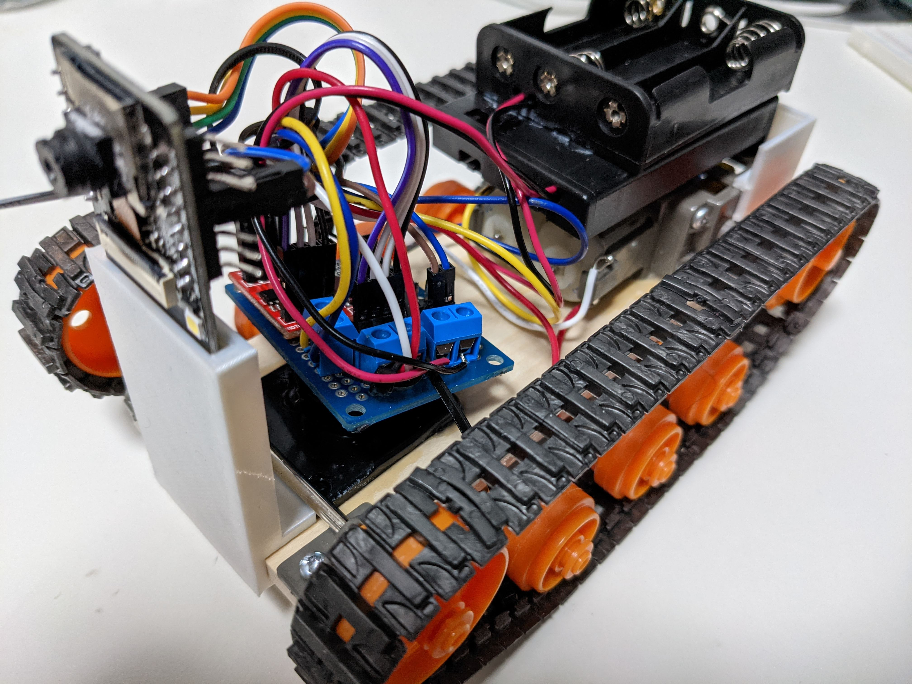
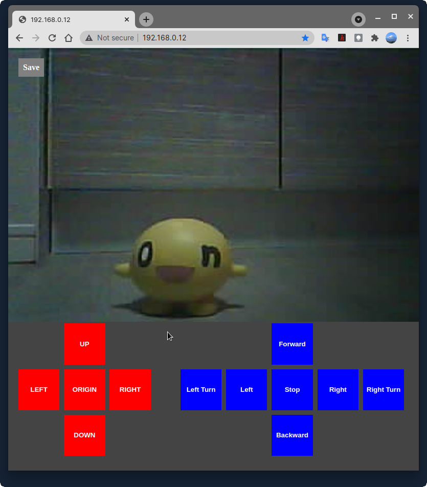
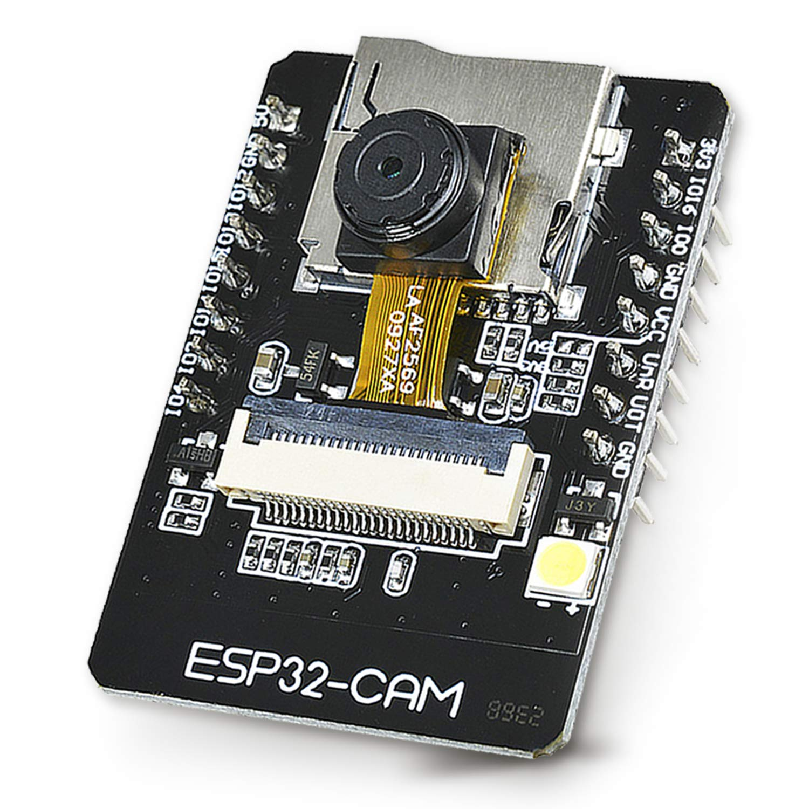
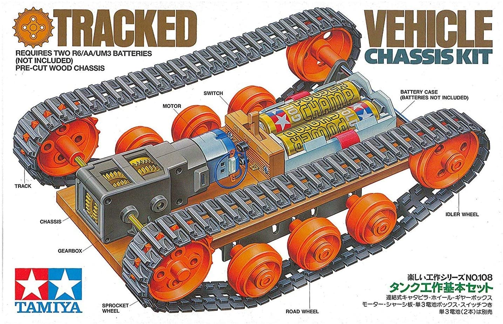
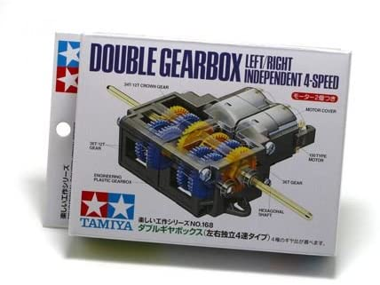
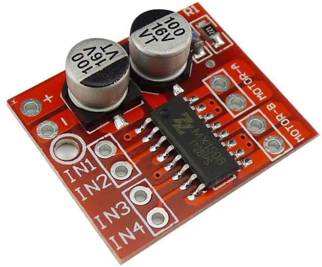
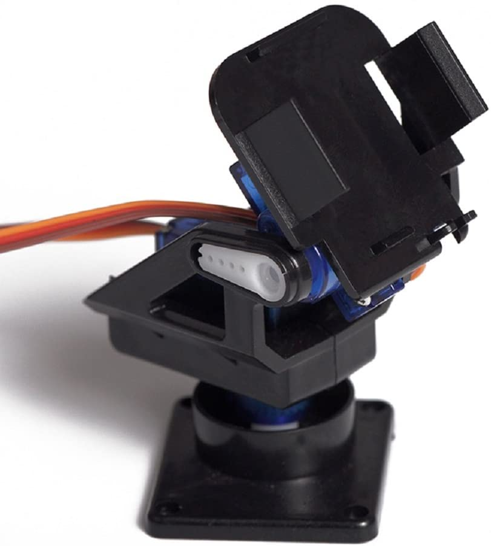
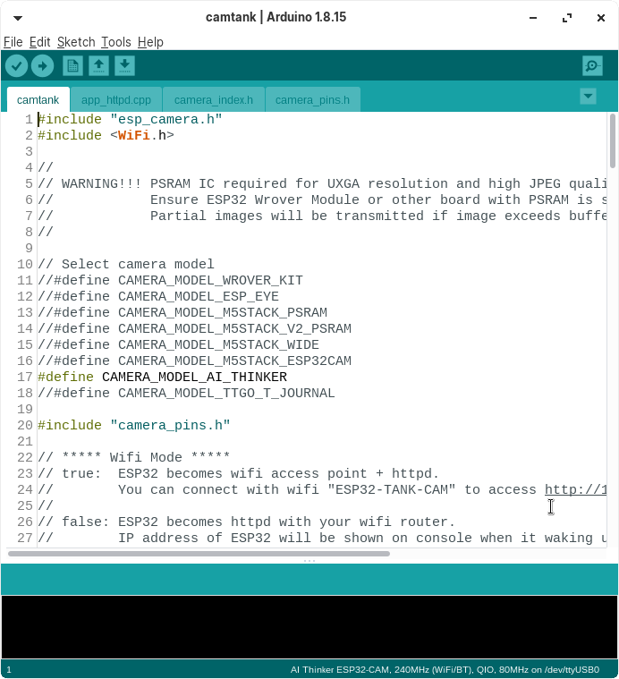

日本語話者のかたには [README.ja.md](/README.ja.md) を用意してあります。  
If you are Japanese speaker, we have [README.ja.md](/README.jp.md) for you.

# Cam Tank
Cam tank is Wifi control tank with camera streaming.

  
  

# Implementation

## Prepare
This project need to components below.

* ESP32-CAM
* TANK Kit with Dual Motor
* 2ch Motor Driver 
* Battery x 2 
* Servo Motor x 2 (Optional but... I don't recommend.)
* Cam Servo Mount (Optional but... I don't recommend.)

ESP32

TANK Kit 

Dual Motor

Motor Driver

Cam Servo Mount 

## ESP32 SetUP
### Install Source Code
1. Clone Git Project in your PC.  
Exec git clone command to download souce code in your pc.   
`git clone https://github.com/koyaaaaaan/cam-tank`
2. Connect ESP32 and PC with Serial.
In case of use USB Serial, connect like this.  
(On going. Please wait for 1 or 2 day)
3. Open Source Code with Arduino IDE  
Open camtank.ino file.
4. Compile and Install  
Do "Upload" command on Arduino IDE.    
When you see "Connecting..." in executing console, you may need to push reset button on ESP32-CAM to start installing.
5. Finish  
Remove the connection between GND and IO0(ZERO).

## Motor Circuit Implements
### Electric Circuit
Make circuit like this.  
(On going. Please wait for 1 or 2 day)

### Behaviors in controll screen.
(On going. Please wait for 1 or 2 day)

## Servo Circuit Implements (not Recommended)
*Warning: Camera of My ESP32-CAM didn't work with Servo PWM outputting. I guess its noise causes confusing camera behaviour. So I recommend to make test the circuit with breadboard before you make the circuit fixed.*

### Electric Circuit
(On going. Please wait for 1 or 2 day)

### Source code Modifying
You can find "# Servo" in camtank.ino and app_httpd.ccp.  
Please remove the comment outs around that.  
After do it, please install source code into ESP32 again.  

### Behaviors in controll screen.
(On going. Please wait for 1 or 2 day)

## Testing
1. Turn TANK CAM on.
2. Connecting the Wifi AP "ESP32-TANK-CAM" with password "tankcam".
3. Access http://192.168.0.12/ with Webbrowser.
4. You can see Controll Buttons and Cam Streaming.
 - Save Button -> Download Cam Screen as JPG format.
 - RED Buttons -> Controll Servo.
 - Blue Buttons - > Conrtoll Motors.

## Hints
* Recommend to connect different battery sources ESP32 and Motors.  
Because energy drain by Motors is so much to restart ESP32 due to lack of Electricity when you connect only one bettery source.
* If you implement Servo, please give up it if Cam or Wifi was freezing when servo working.  
There can be some conflicting between cam and wifi and servo.  
Servo work(PWM) is a biggest issue.
* When you learn the system, you should use another components if you wanna implements more stable one.
